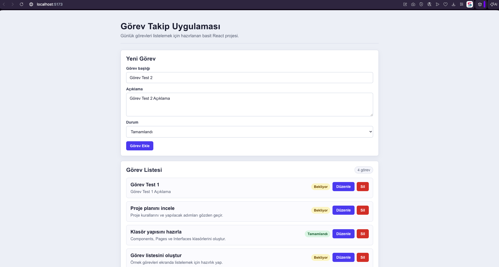

# Görev Takip Uygulaması

Bu proje, React ile hazırlanmış basit bir görev takip uygulamasıdır. Kullanıcı görev ekleyebilir, görevleri listeleyebilir, güncelleyebilir ve silebilir.

## Kullanılan Teknolojiler

- React
- Vite
- JavaScript
- CSS
- LocalStorage

## Özellikler

- Görev ekleme
- Görev listeleme
- Görev güncelleme
- Görev silme
- Sayfa yenilendiğinde görevleri saklama

## Kurulum

Projeyi bilgisayarda çalıştırmak için:

```bash
npm install
```

## Çalıştırma

```bash
npm run dev
```

Tarayıcıda açılacak adres:

```text
http://localhost:5173/
```

## Ekran Görüntüsü



## Canlı Link

Proje Vercel ile yayına alınmıştır.

https://tcn-project-web-gelistirme.vercel.app
